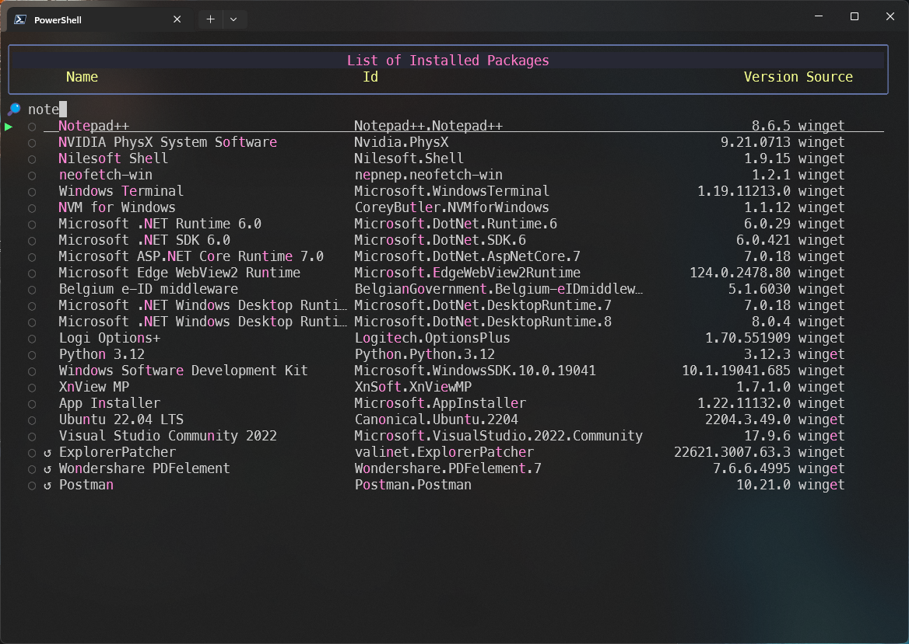
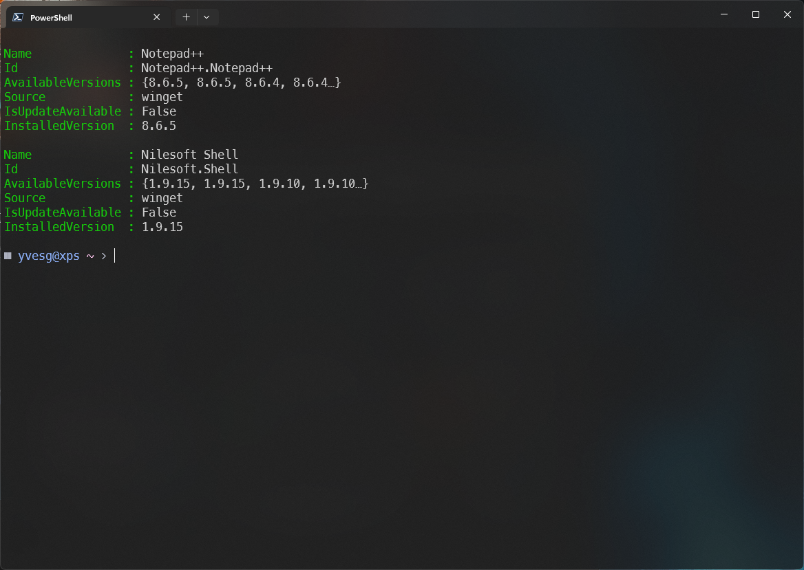

```
                    WWWWWWWW                           WWWWWWWW iiii                   
                    W::::::W                           W::::::Wi::::i                  
                    W::::::W                           W::::::W iiii                   
                    W::::::W                           W::::::W                        
                    W:::::W           WWWWW           W:::::Wiiiiiiinnnn  nnnnnnnn    
                      W:::::W         W:::::W         W:::::W i:::::in:::nn::::::::nn  
                      W:::::W       W:::::::W       W:::::W   i::::in::::::::::::::nn 
                        W:::::W     W:::::::::W     W:::::W    i::::inn:::::::::::::::n
                        W:::::W   W:::::W:::::W   W:::::W     i::::i  n:::::nnnn:::::n
                          W:::::W W:::::W W:::::W W:::::W      i::::i  n::::n    n::::n
                          W:::::W:::::W   W:::::W:::::W       i::::i  n::::n    n::::n
                            W:::::::::W     W:::::::::W        i::::i  n::::n    n::::n
                            W:::::::W       W:::::::W        i::::::i n::::n    n::::n
                              W:::::W         W:::::W         i::::::i n::::n    n::::n
                              W:::W           W:::W          i::::::i n::::n    n::::n
                                WWW             WWW           iiiiiiii nnnnnn    nnnnnn
                                                                                                
                                                                            kkkkkkkk           
                                                                            k::::::k           
                                                                            k::::::k           
                                                                            k::::::k           
                    ppppp   ppppppppp     aaaaaaaaaaaaa      cccccccccccccccc k:::::k    kkkkkkk
                    p::::ppp:::::::::p    a::::::::::::a   cc:::::::::::::::c k:::::k   k:::::k 
                    p:::::::::::::::::p   aaaaaaaaa:::::a c:::::::::::::::::c k:::::k  k:::::k  
                    pp::::::ppppp::::::p           a::::ac:::::::cccccc:::::c k:::::k k:::::k   
                    p:::::p     p:::::p    aaaaaaa:::::ac::::::c     ccccccc k::::::k:::::k    
                    p:::::p     p:::::p  aa::::::::::::ac:::::c              k:::::::::::k     
                    p:::::p     p:::::p a::::aaaa::::::ac:::::c              k:::::::::::k     
                    p:::::p    p::::::pa::::a    a:::::ac::::::c     ccccccc k::::::k:::::k    
                    p:::::ppppp:::::::pa::::a    a:::::ac:::::::cccccc:::::ck::::::k k:::::k   
                    p::::::::::::::::p a:::::aaaa::::::a c:::::::::::::::::ck::::::k  k:::::k  
                    p::::::::::::::pp   a::::::::::aa:::a cc:::::::::::::::ck::::::k   k:::::k 
                    p::::::pppppppp      aaaaaaaaaa  aaaa   cccccccccccccccckkkkkkkk    kkkkkkk
                    p:::::p                                                                    
                    p:::::p                                                                    
                    p:::::::p                                                                   
                    p:::::::p                                                                   
                    p:::::::p                                                                   
                    ppppppppp 
```

***

Demo : https://youtu.be/1zmkSVk-O_A
  


Winpack is a TUI for the Winget CLI.

It uses charmbracelet/gum to render the output in the terminal.

Dependencies :
- charmbracelet-gum
- Winget-Cli  

**These two dependencies are automatically installed if they're not found when the module loads.** 
*** 

## Functions : 
- Get-WGPackages
- Find-WGPackages
- .... more to come

### Get-WGPackages
Usage :
```
Get-WGPackages [-update] [-uninstall] [-source "source"]
```


Without any parameters, the function renders a list of every packages installed on the computer, no matter the source.

There a 3 columns : 
- Name : The actual name of the package
- Id : The Id package on the repository
- Version : The current version installed on the computer

Below the header, a filter allow to input text to narrow the list.  
One can use ⬆️/⬇️ keys or *Ctrl-J* / *Ctrl-K* to move the selection cursor.  
Pressing *Tab* allow to select / deselect the current line  
*Esc* quits the list without selection.  
*Enter* exits the list, returning the selected packages  
  
If a package has an available update, a "↺" is displayed to the left of the name.

When the **-update** parameter is used, only packages with update availables will be shown.  
Then, if *Enter* is pressed to exit, the selected packages will be automatically updated.

When the **-uninstall** parameter is used, the selected packages are automatically uninstalled if *enter* is used to exit.

The **-source** parameter allows to filter the list to the selected source.
For now,  "winget" and "msstore" are the available options. **Scoop** will come later.

The *filter* function uses a regex to search in every field of the list.  



So, every grid line that matches the filter characters (not contiguous !!) are included.  
To narrow the selection, one has to be more specific in the filter input field.

In the above example, pressing *Enter* results in this :



It's an array of ```PSCustomObject``` usable in any other command, function or script.

***
### Find-WGPackages
Usage :  
```
Find-WGPackage [-query "query"] [-source "source"] [-install]
```


If no parameter is passed to the function, it will display an input message to enter the _query_.  
The _query_ is mandatory to perform the search.  
If no _query_ is entered, there will be no search and a error will be throwned.  


When the _query_ is filled, the research is launched.  
One can enter multiple terms in one search.  To do so, just separate the search terms with a comma.  


This will result in something like that :


Just as for the _Get-WGPackages_  there are 3 columns and a _Filter_ input field.

The workflow is exactly the same.

Below the header, a filter allow to input text to narrow the list.  
One can use ⬆️/⬇️ keys or *Ctrl-J* / *Ctrl-K* to move the selection cursor.  
Pressing *Tab* allow to select / deselect the current line  
*Esc* quits the list without selection.  
*Enter* exits the list, returning the selected packages.

If _-Install_ parameter is specified when calling the function, the selected packages will be installed automatically.  Othewise, an array of ```PSCustomObject``` will be returned.

The _-Source_ parameter allows to narrow the search to a specified source.  
For now,  "winget" and "msstore" are the available options. **Scoop** will come later.

The *filter* function uses a regex to search in every field of the list.  